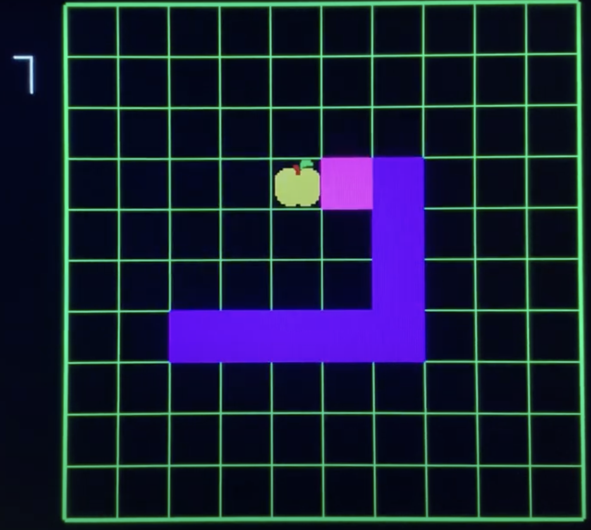
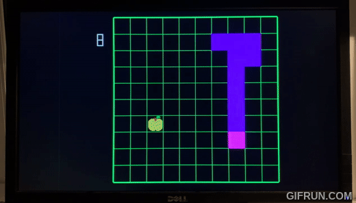

# Tufts ES4 - Intro to Digital Logic Final Project
## Snake Game using FPGA and VHDL

This is a final project between Chris Bann, Ethan Hsu, Gabriel Sessions, and Ivan Qin. In this project, the classic Snake arcade game is implemented using a FPGA. The FPGA is programmed with VHDL and connected to a external display using VGA. The repository contains all the code written to achieve this final result. Below, you can find a short demo, and the full demo video can be found [here](https://www.youtube.com/watch?v=86ho9ddVpio).

### Modules Hierachy
Below are the modules hierachy written by Ethan during the development stage to clarify the logic of each module. Note that this project is by no mean production quality, and there are many rooms for improvements, but it was our best work at the time.

Top (topModule.vhd):
    - Take inputs through NES module
    - Use display module to produce the inputs VGA need, 
        the board will take NES module input.
    - Produce outputs through VGA module

VGA:
        Ivan
NES:
        Gabriel

Display:
    - Throw inputs into the board / menu module depends on which one we need
        - We might scale the board based on what is the size of the board.
    - Concat board and menu together and handle paddings, to produce an output
        for VGA module.

Board:
    - Here we stores constants using generic.
    - If the game starts, we take the inputs and start doing works.
    - The output will need to indicate the following:
        - Whether the game is over
        - Enough information to populate the display such as position of snakes
          and apples.

snakePos:
    - This module will take inputs and decide the next location of the snake
    - Perhaps the Module will also return an output that tells us whether the
        snake has collisioned with himself / border.

## NES Notes
Button inputs are stored as a std_logic_vector of size 8 (7 downto 0). Button input is indicated by a zero value.

Ex: "01111110" = LEFT and A pressed
- output(0) = RIGHT directional button
- output(1) = LEFT directional button
- output(2) = DOWN directional button
- output(3) = UP directional button
- output(4) = START button
- output(5) = SELECT button
- output(6) = B button
- output(7) = A button
